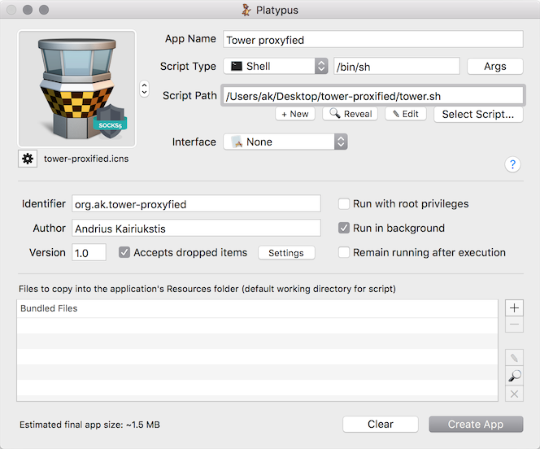
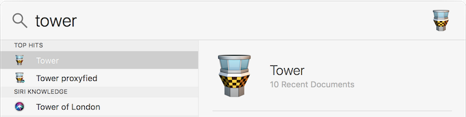

Tower through SOCKS5 proxy
==========================

# Why?

Tower is the best git cloent for mac, but it does not have proxy support. Often, in order to follow security requirements, it is important to proxify it.

# Installation instructions

- Install [Tower git](https://www.git-tower.com/mac) client;

- Install proxychains-ng `brew install proxychains-ng w3m` and configure it:

    ```bash
    mkdir -p ~/.proxychains
    cp configs/proxychains.conf ~/.proxychains
    vim ~/.proxychains/proxychains.conf

    # at the bottom of proxychains.conf, find section [ProxyList],
    # enter host and port with your SOCKS5 proxy, i.e.
    # socks5 127.0.0.1 7070
    ```

- Test your proxychains installation and settings:

    ```bash
    /usr/local/bin/proxychains4 -q -f ~/.proxychains/proxychains.conf w3m ifconfig.co
    ```

- Unzip Tower proxyfied.zip and install it (move to the /Applications folder);

- Done!

# Create your own application

- Create shell script and test it (check `tower.sh`);

- Download source icons and create iconset following [this howto](https://blog.macsales.com/28492-create-your-own-custom-icons-in-10-7-5-or-later);

- Download Platypus from [http://sveinbjorn.org/platypus](http://sveinbjorn.org/platypus/), start it and create application as described on following screenshot:

    

- Install it (move to the /Applications folder);

- Application will became available in spotlight:

    

